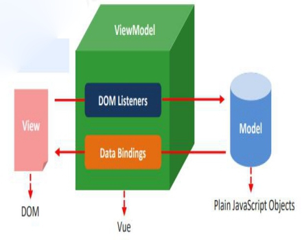

## vue基本步骤
```
vue的基本使用步骤
1.需要提供标签用于填充数据
2.引入vue.js库文件
3.可以使用vue的语法做功能了
4.把vue提供的数据填充到标签里面
```
```
1.实例参数分析
	el:元素的挂载位置(值可以是css选择器或者dom元素)	el=element 元素 要管理的容器
	data:模型数据(值是一个对象) 给html输入内容
2.插值表达式用法
	将数据填充到HTML标签中
	插值表达式支持基本的计算操作
3.Vue代码运行原理分析
	概述编译过程的概念(Vue语法->原生语法)
```

### 把数据填充到HTML标签中
```
 原生js拼接字符串
 使用前端模板引擎
```
### Vue模板语法
```
模板语法概览
插值表达式 {{内容}}
指令
事件绑定
属性绑定
样式绑定
分支循环结构
```
### 3.2指令
````
1.什么是指令?
	什么事自定义属性
	v-cloak指令:
	v-cloak 解决存在闪动的问题
	使用的方法 用v-cloak
	原理:先隐藏,替换好值之后在显示最终的值
	三个数据绑定指令:
	v-text指令:
	v-text输出的是纯文本.浏览器不会对其再进行html解析
	v-html指令:
	v-html会对其当中html标签进行解析后输出
	v-pre指令:
	显示原始信息跳过编译过程
	一些静态的内容不需要编译加这个指令可以加快渲染速度
````
### 数据响应式
```
* 如何理解响应式
	1. html5中的响应式(屏幕尺寸的变化导致样式的变化)
	2. 数据的响应式(数据的变化导致页面内容的变化)
* 什么是数据绑定
	1. 数据绑定:将数据填充到标签中
* v-once只编译一次
	! v-once的应用场景:如果显示的信息后续不需要在修改,你们可以使用v-once,这样可以提高性能.
	1. 显示内容之后不再具有响应式功能
```
### 双向数据绑定与v-mode指令用法
```
* 什么是双向数据绑定
	* 当数据发生变化的时候,视图也就发生变化
	* 当视图发生变化的时候,数据数据也会跟着同步变化
* 双向绑定的使用场景
	* v-mode是一个指令,限制在<input>,<select>,<textarea>,components(组件)中使用(文本域标签中)
* Vue在通过哪一个指令实现双向绑定?
	* v-model
```

### MVVM设计思想
```
* M model
	* 数据层Vue中 数据层 都放在data里面
* V view 视图
	* Vue中 view 即 我们的HTMl页面
* VM (view-model) 控制器 将数据和视图层建立联系
	* vm即Vue的实例就是vm
```
### 事件绑定
```javascript
1. Vue如何处理事件?
	* v-on指令用法
	<input type='button' v-on:click='num++'/>
	* v-on简写形式
	<input type='button' @click='num++'/>
2. 事件函数的调用方式
	* 直接绑定函数名称
	<button v-on:click='say'>Hello<button/>
	* 调用函数
	<button v-on:click='say()'>Say hi<button/>
3. 事件函数参数传递
	* 普通参数和事件对象
	<button v-on:click='say("hi",$event)'>Say hi<button/>
	<!-- 
	事件绑定-参数传递
	事件对象:鼠标在电脑点击的坐标值 需要获取 键盘按下的键盘码(onkeydown) 这些类似的数据是保存到事件对象
	1. 如果事件直接绑定函数名称,那么默认会传递事件对象作为事件函数的第一个参数
	2. 如果事件绑定函数调用,那么事件对象必须作为最后一个参数显示传递,并且事件对象的名称必须是$event
	获取事件对象有两种方法:
	1. 调用函数时没有值传递实参 函数的可以用任何一个形参来表示 事件对象
	2. 调用函数 传递了实参 实参列表中的最后一个 $event 他就表示事件对象 函数的形参可以用任何一个变量来接受
	 -->
```
**构造函数的this指向实例对象**
### 阻止默认行为在vue中 事件修饰符
```javascript
1. 原生js中
	* 阻止默认行为event.preventDefault()
	* 阻止冒泡行为event.stopPropagation()
2. vue中
	* .stop阻止冒泡
		<a v-on:click.stop="handle">跳转</a>
	* .prevent 阻止默认行为
		<a v-on:click.prevent="handle">跳转</a>
```
### 按键修饰符
```javascript
* .enter 回车键
	<input v-on:keyup.enter="submit">
* .delete 删除键
	<input v-on:keyup.delete="handle">
```
### 自定义按键修饰符
```javascript
* 全局 config.keyCodes 对象自定义按键修饰符别名:
	* 规则:自定义按键修饰符名字是自定义的,但是对应的值必须是按键对应event.keyCode值
```
### 属性绑定
```javascript
1. Vue如何动态处理属性?
	* v-bind指令用法
		<a v-bind:href='url'>跳转</a>
	* 缩写形式
		<a :href='url'>跳转</a>
<!-- 
	v-on对事件绑定
	v-bind 属性绑定 对html标签的属性进行处理的 addClass removeClass toggleClass
	:要绑定的属性名
 -->
```
### v-model的底层实现原理分析
```javascript
	<input v-bind:value="msg" v-on:input="msg=$event.target.value">
```
* 三种表现v-model方式


### Vue模板语法

**3.6样式绑定**

```javascript
1. class样式处理
	* 对象语法
		<div v-bind:class="{active:isActive}"></div>
	* 数组语法
		<div v-bind:class="{activeClass,errorClass}"></div>
```
**前端安全XSS攻击**
```
XSS
XSS简单一点就是黑客将代码注入到你的页面中然后运行代码
XSS分两种类型:持久型和非持久型.
持久型 就是指将代码注入你的服务器,当你在某个时刻调用的时候会直接运行代码,窃取到你的数据.
非持久型 一般通过修改URL参数的方式加入攻击代码,诱导用户访问链接从而进行攻击.
* 持久型:比如说在输入密码的时候,我将一段后台语言的代码写在密码框里面,比方说java代码写在密码框里面,这段代码被发送到后台之后可能直接就运行了,这样就会造成无法想象的后果
* 非持久型:一般都是在地址栏里面写一些转账之类的代码,诱导用户点击,但是现在绝大多数的浏览器会过滤到这些代码
xss防御办法
```
